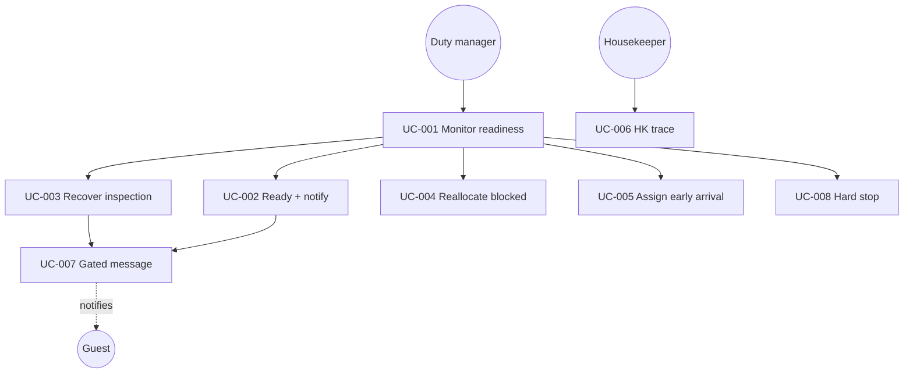

# Use cases — Room Readiness Coordinator

Behavioral specs for the **clickable prototype**. They describe the closed loop that is demoable today. They do not claim the event bus, named specialist-agent UI, or six-month platform.

**System:** Room Readiness Coordinator (orchestration layer on top of Mews records)  
**Live demo:** https://prachister-1.github.io/room-readiness-coordinator/

## Actors

| Actor | Role in the prototype |
|---|---|
| Duty manager (Alex Morgan) | Primary operator. Approves allocation, inspection reassignment, reallocation; sends or holds guest messages. |
| Housekeeper (Anna K.) | Executes traces. Starts, completes, or flags problems. Does not see AI recommendations. |
| Supervisor (Priya S.) | Completes inspection evidence (simulated via “Mark inspection complete”). |
| Guest | Receives messages only. No guest-facing UI in this prototype. |
| Coordinator | System actor. Detects risk, proposes bounded actions, verifies checks, gates messaging. |

## Catalog (implemented in the prototype)

| ID | Title | Actor | Demo guest | Priority |
|---|---|---|---|---|
| [UC-001](./UC-001-monitor-arrival-readiness.md) | Monitor arrival readiness | Duty manager | Board | Must-have |
| [UC-002](./UC-002-verify-and-notify-ready-room.md) | Verify and notify a ready room | Duty manager | Kiara Garcia | Must-have |
| [UC-003](./UC-003-recover-at-risk-inspection.md) | Recover an at-risk inspection | Duty manager | Sofia Garcia | Must-have |
| [UC-004](./UC-004-reallocate-blocked-room.md) | Reallocate a blocked room | Duty manager | Daniel Kim | Must-have |
| [UC-005](./UC-005-assign-unassigned-early-arrival.md) | Assign a room for an unassigned early arrival | Duty manager | Olivia Brown | Must-have |
| [UC-006](./UC-006-execute-housekeeping-trace.md) | Execute a housekeeping trace | Housekeeper | Anna K. | Must-have |
| [UC-007](./UC-007-send-gated-guest-message.md) | Send a gated guest message | Duty manager | Kiara / Sofia | Must-have |
| [UC-008](./UC-008-escalate-policy-hard-stop.md) | Escalate a policy hard stop | Duty manager | Kenji / Priya Nair | Should-have |

## System diagram

## Plan coverage

These use cases implement the plan’s MVP loop: **early arrivals, special requests, room blockers**, with **recommend-and-approve**, **verified messaging**, and **no PMS replacement**.

Not in this prototype (stay in the architecture plan): guest-message NLP (“noon + cot”), named agent UI, full state machine, pause/rollback automation modes, guest-facing screens, live re-plan after a HK flag.
