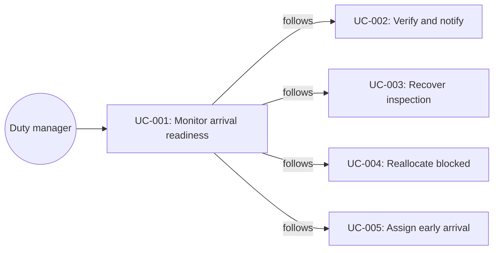

# UC-001: Monitor arrival readiness

**Primary Actor:** Duty manager  
**Goal:** See today’s arrival risk and the next safe action in seconds  
**Scope:** Room Readiness Coordinator  
**Level:** Summary

## Use Case Diagram

## Preconditions

- The property day is open (prototype: The Hoxton Shoreditch, 15 August).
- Reservation, room, housekeeping, maintenance, and check-in signals are available as mocked Mews records.

## Trigger

The duty manager opens Arrival Readiness (the default home screen).

## Main Success Scenario

1. The duty manager opens the operations control tower.
2. The system shows KPI cards: arrivals today, rooms verified ready, at risk, blocked, ready-by-promise rate, average turnaround.
3. The system shows a readiness forecast by hour, with peak pressure marked at 14:00.
4. The system lists explainable AI recommendations that have not been executed.
5. The system places each Readiness Case into Ready, In preparation, At risk, or Blocked.
6. The duty manager clicks a guest card.
7. The system opens that guest’s Readiness Case drawer.

## Extensions

**4a. Duty manager acts on a recommendation from the board:**
1. The duty manager chooses Assign 416, Open Sofia, or Open Daniel.
2. Continue in UC-005, UC-003, or UC-004.

## Postconditions

**Success guarantee:** Every visible arrival has a Readiness Case with status, room (or unassigned), task progress, risk reason, and next action.  
**Minimal guarantee:** No PMS write occurs from viewing the board.

## Business Rules

- BR-1: The board is the primary surface, not a chat interface.
- BR-2: Recommendations are labelled as not yet executed until approved.
- BR-3: The coordinator does not replace Mews as system of record; it observes and proposes.

## Related Use Cases

- **Follows:** UC-002, UC-003, UC-004, UC-005, UC-008 — case-level work started from the board

## Metadata

- **Priority:** Must-have
- **Complexity:** M
- **Screen References:** Arrival Readiness (`/`), Readiness Case drawer
