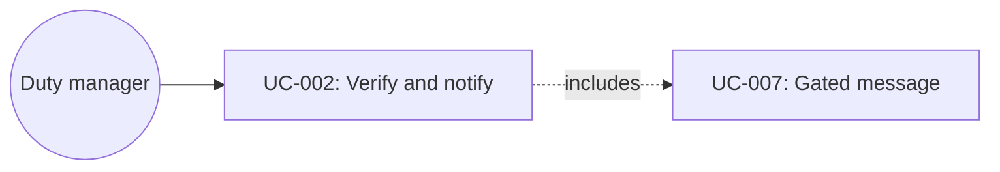

# UC-002: Verify and notify a ready room

**Primary Actor:** Duty manager  
**Goal:** Confirm a room is operationally ready and that the guest has been told  
**Scope:** Room Readiness Coordinator  
**Level:** User Goal

## Use Case Diagram

## Preconditions

- A Readiness Case exists (demo: Kiara Garcia, reservation MH-48291).
- Booked category is Deluxe King; Room 412 is assigned.
- Required traces for clean, feather-free bedding, and inspection are complete.
- Payment is pre-authorised and digital check-in is complete.

## Trigger

The duty manager opens Kiara Garcia’s Readiness Case from the Ready column.

## Main Success Scenario

1. The duty manager selects Kiara Garcia.
2. The system shows status Room ready, verified at 11:42, Room 412 Deluxe King.
3. The system shows the readiness timeline through “Guest message sent”.
4. The system shows “Why this room?” with the policy rationale (category match, quiet floor, early arrival, feather-free SOP).
5. The system shows guest requirements and a completed readiness checklist.
6. The system shows traces with owners, due times, and evidence.
7. The system shows next action: Guest has been notified. No further action required.
8. The duty manager may open the audit trail.

## Extensions

**2a. Checks are not all complete:**
1. The system must not offer a room-ready guest message (UC-007).
2. Use case ends with the case remaining In preparation, At risk, or Blocked.

## Postconditions

**Success guarantee:** Case stays Ready; audit contains allocation, inspection, verification, and message events; guest-ready message is marked sent.  
**Minimal guarantee:** Opening the case does not change room assignment.

## Business Rules

- BR-1: Only the coordinator may mark the overall case Ready, and only after all configured checks pass.
- BR-2: Special-request evidence (feather-free bedding) must be on the trace, not inferred from chat.
- BR-3: A ready message may reference verified preferences only.

## Related Use Cases

- **Includes:** UC-007 Send a gated guest message — message already sent on the happy path
- **Precedes:** UC-001 Monitor arrival readiness

## Metadata

- **Priority:** Must-have
- **Complexity:** S
- **Screen References:** Arrival Readiness Ready column, Readiness Case drawer (Kiara)
