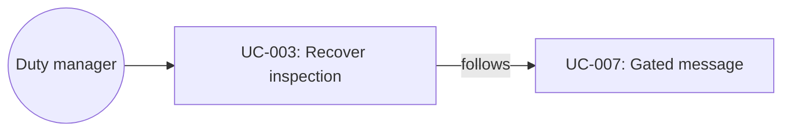

# UC-003: Recover an at-risk inspection

**Primary Actor:** Duty manager  
**Goal:** Protect a promised arrival time when inspection has not started  
**Scope:** Room Readiness Coordinator  
**Level:** User Goal

## Use Case Diagram

## Preconditions

- Readiness Case exists (demo: Sofia Garcia, ETA 14:00, Room 225 Deluxe King).
- Cleaning and payment/check-in traces are complete.
- Final inspection trace is overdue / not started (3 of 4 traces complete).
- Case status is At risk.

## Trigger

The duty manager opens Sofia Garcia from the At risk column or from the AI recommendation “protect Sofia’s 14:00 promise”.

## Main Success Scenario

1. The duty manager opens Sofia’s case.
2. The system shows the risk: inspection has not started; time remains against the 14:00 promise.
3. The system shows an Exception recommendation that is not yet executed: reassign final inspection to Priya S. on Floor 2, expected ready 13:56, medium confidence.
4. The duty manager chooses Approve recommendation.
5. The system moves the case to In preparation, reassigns the inspection trace to Priya S., writes an audit event, and toasts “Inspection reassigned to Priya S.”
6. The duty manager chooses Mark inspection complete (simulated supervisor evidence).
7. The system sets status to Room ready, completes remaining checks, unlocks the room-ready template, and records verification in the audit log.
8. The duty manager sends the room-ready message (UC-007).

## Extensions

**4a. Choose another room:**
1. The duty manager picks an inspected same-category alternative.
2. The system updates assignment and keeps messaging locked until the new room is verified.
3. Use case continues at verification.

**4b. Escalate to duty manager:**
1. The system records escalation with the evidence packet and does not write a room move.
2. Use case ends with human ownership; guest is not told the room is ready.

## Postconditions

**Success guarantee:** Inspection owner is Priya S.; case is Ready only after the complete step; a room-ready message is possible only then.  
**Minimal guarantee:** Until approval, no trace owner changes.

## Business Rules

- BR-1: Exception recommendations do not write until approved.
- BR-2: Messaging Agent must not send “room ready” at the At risk or In preparation states.
- BR-3: Confidence and rationale must be visible before approval.

## Related Use Cases

- **Follows:** UC-007 Send a gated guest message
- **Precedes:** UC-001 Monitor arrival readiness

## Metadata

- **Priority:** Must-have
- **Complexity:** M
- **Screen References:** Arrival Readiness At risk, AI recommendations, Sofia Readiness Case
