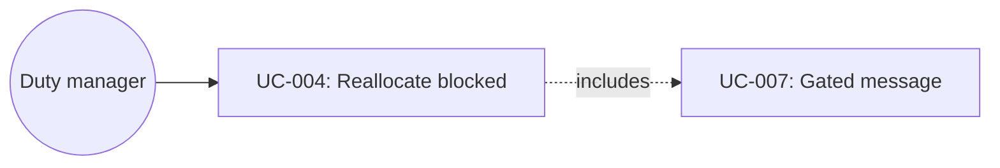

# UC-004: Reallocate a blocked room

**Primary Actor:** Duty manager  
**Goal:** Recover a suite arrival when the assigned room is blocked by maintenance  
**Scope:** Room Readiness Coordinator  
**Level:** User Goal

## Use Case Diagram

## Preconditions

- Readiness Case exists (demo: Daniel Kim, ETA 15:00, Suite, Room 507).
- Bathroom maintenance trace on 507 is overdue; room is unsafe to sell.
- Suite 510 is inspected, same category, no maintenance issues.
- Case status is Blocked.

## Trigger

The duty manager opens Daniel Kim from the Blocked column or from the recommendation “alternative suite 510 is available”.

## Main Success Scenario

1. The duty manager opens Daniel’s case.
2. The system explains the blocker and recommends Room 510, with why-this-room rationale.
3. The duty manager chooses Approve reallocation.
4. The system changes assignment 507 → 510, cancels 507-specific traces, creates a 510 handover trace, sets status to In preparation, and writes the audit entry.
5. The system shows a holding guest draft that does not claim the suite is ready.
6. Room-ready send remains locked until 510 is verified.

## Extensions

**3a. Keep Room 507 and escalate maintenance:**
1. Assignment stays 507; maintenance is escalated; case stays Blocked.
2. Use case ends; no guest-ready claim.

**3b. Contact guest:**
1. The system keeps the holding draft (UC-007). Send is allowed only for non-ready wording.

## Postconditions

**Success guarantee:** Assigned room is 510; 507 traces are cancelled; case is In preparation; message is a holding note.  
**Minimal guarantee:** Approving reallocation never marks the case Ready in the same step.

## Business Rules

- BR-1: Reallocation must stay in booked category (Suite → Suite).
- BR-2: Out-of-order rooms cannot remain sellable.
- BR-3: Guest communication after reallocation is expectation-setting until verification.

## Related Use Cases

- **Includes:** UC-007 Send a gated guest message — holding draft only
- **Precedes:** UC-001 Monitor arrival readiness

## Metadata

- **Priority:** Must-have
- **Complexity:** M
- **Screen References:** Arrival Readiness Blocked, Daniel Readiness Case
