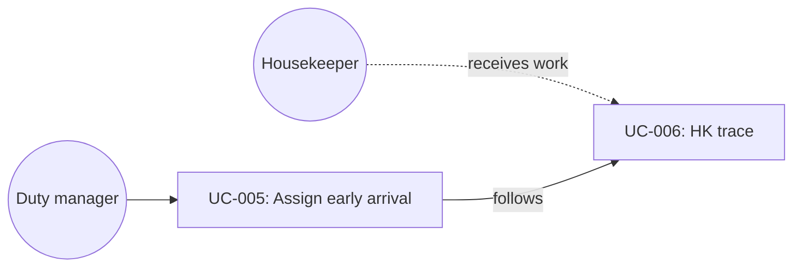

# UC-005: Assign a room for an unassigned early arrival

**Primary Actor:** Duty manager  
**Goal:** Place an early-arrival guest into a matching inspected room before the promised time  
**Scope:** Room Readiness Coordinator  
**Level:** User Goal

## Use Case Diagram

## Preconditions

- Readiness Case exists (demo: Olivia Brown, ETA 12:30, Standard Double, unassigned).
- Early arrival is requested; payment and digital check-in are complete.
- Room 416 is an inspected Standard Double that can support 12:30.

## Trigger

The duty manager opens Olivia from At risk, or chooses Assign 416 on the AI recommendations panel.

## Main Success Scenario

1. The duty manager reviews Olivia’s case: unassigned, early arrival, candidate rooms available.
2. The system recommends Room 416 with high confidence and an explanation.
3. The duty manager approves the assignment.
4. The system sets Room 416, moves the case to In preparation, marks allocation confirmed, and audits the decision.
5. Messaging stays locked until remaining traces (turn / inspection) are verified.

## Extensions

**3a. Duty manager does not assign:**
1. Case remains At risk and unassigned.
2. Use case ends with no write.

## Postconditions

**Success guarantee:** Olivia has Room 416; status is In preparation; allocation check is complete; room-ready message is still locked.  
**Minimal guarantee:** Recommendation text is visible whether or not it is approved.

## Business Rules

- BR-1: Auto-assign is not enabled in this prototype; assignment requires approval.
- BR-2: Candidate rooms must match booked category and support the arrival window.
- BR-3: Early arrival is an operational intent, not a guaranteed upgrade.

## Related Use Cases

- **Follows:** UC-006 Execute a housekeeping trace — Floor 4 still has “Prepare room for early arrival” on 416
- **Precedes:** UC-001 Monitor arrival readiness

## Metadata

- **Priority:** Must-have
- **Complexity:** S
- **Screen References:** Arrival Readiness At risk, AI recommendations, Olivia Readiness Case
