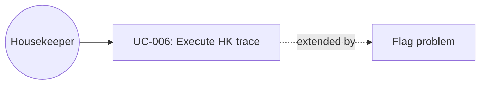

# UC-006: Execute a housekeeping trace

**Primary Actor:** Housekeeper  
**Goal:** Complete the next room task with only the information needed to do the work  
**Scope:** Room Readiness Coordinator  
**Level:** User Goal

## Use Case Diagram

## Preconditions

- The housekeeper is signed in as Anna K., Floor 4 (or the header role is set to Housekeeping).
- Traces have been created for her route (including Room 416 early-arrival prep and Room 412 completed feather-free turn).

## Trigger

The housekeeper opens the Housekeeping tab.

## Main Success Scenario

1. The housekeeper opens My tasks.
2. The system shows a mobile task list ordered by urgency, with progress (complete vs remaining).
3. The housekeeper selects a due task (e.g. Room 416).
4. The system shows action, due time, why it matters, required items, and checklist — not the full arrivals board and not an AI chat.
5. The housekeeper chooses Start task, then Mark complete.
6. The system marks the trace complete and notifies that the coordinator will re-evaluate readiness.

## Extensions

**5a. Flag a problem:**
1. The housekeeper chooses Flag and picks Maintenance issue, Room not vacated, Missing item, Cannot complete, or Other.
2. The system toasts that the coordinator is notified and the readiness plan will be re-evaluated.
3. In this prototype the board is not automatically rewritten; the operational contract is the notification.

**4a. Task already complete:**
1. The housekeeper can review evidence (e.g. Room 412 feather-free) but does not re-do the work.

## Postconditions

**Success guarantee:** Selected task status is complete or blocked; a toast confirms coordinator notification.  
**Minimal guarantee:** Housekeeping cannot send guest-ready messages from this screen.

## Business Rules

- BR-1: No AI recommendation or approve control on this surface.
- BR-2: Guest context is operational only (“early arrival”, “cot”, “feather-free”), not clinical or payment detail.
- BR-3: Completing a task is evidence for the coordinator; it does not by itself mark the Readiness Case Ready.

## Related Use Cases

- **Precedes:** UC-005 Assign a room for an unassigned early arrival — 416 work is why 416 appears on the route

## Metadata

- **Priority:** Must-have
- **Complexity:** S
- **Screen References:** Housekeeping (`/housekeeping`)
