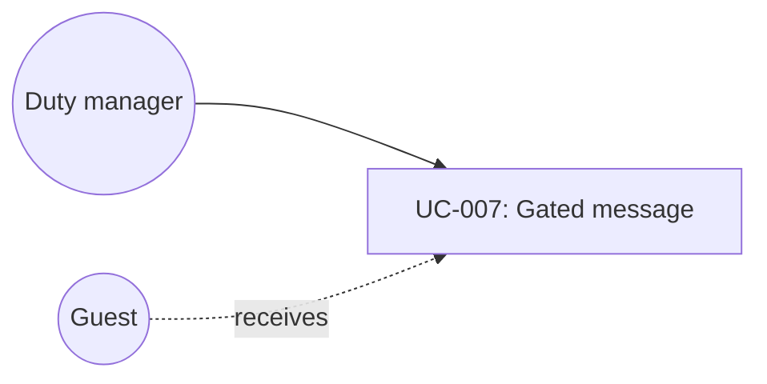

# UC-007: Send a gated guest message

**Primary Actor:** Duty manager  
**Goal:** Tell the guest the truth: ready only when verified, otherwise a holding update  
**Scope:** Room Readiness Coordinator  
**Level:** Subfunction

## Use Case Diagram

## Preconditions

- A Readiness Case is selected in Guest Messages or from the case drawer.
- An approved template exists for ready or holding copy.

## Trigger

The duty manager opens Guest Messages or chooses Message guest on a case.

## Main Success Scenario

1. The duty manager selects a guest (Kiara for sent ready copy; Sofia for a holding draft).
2. The system shows channel, language, body, and an approval badge.
3. If all readiness checks are complete and status is Ready, the badge is “Safe to send: readiness verified”.
4. The duty manager chooses Send now.
5. The system records the send in the audit log.

## Extensions

**3a. Checks incomplete or status not Ready:**
1. The badge is “Awaiting operational confirmation”.
2. Send now is disabled if the body claims “room is ready”.
3. A holding message that does not claim readiness may still be sent.
4. Use case ends with no false ready promise.

## Postconditions

**Success guarantee:** Sent copy matches policy: ready only after verification.  
**Minimal guarantee:** The system never enables a ready-claim send while checks are incomplete.

## Business Rules

- BR-1: Never message that a room is ready until mandatory checks are verified.
- BR-2: Holding messages must not claim readiness.
- BR-3: Channel (SMS / WhatsApp / Email) does not override the readiness gate.

## Related Use Cases

- **Included by:** UC-002, UC-003, UC-004

## Metadata

- **Priority:** Must-have
- **Complexity:** S
- **Screen References:** Guest Messages (`/messages`), Readiness Case Message guest
