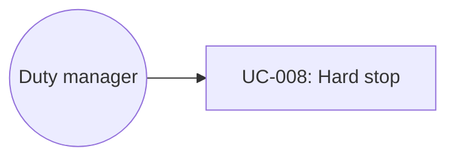

# UC-008: Escalate a policy hard stop

**Primary Actor:** Duty manager  
**Goal:** Stop the coordinator from inventing an unsafe room move  
**Scope:** Room Readiness Coordinator  
**Level:** User Goal

## Use Case Diagram

## Preconditions

- A Readiness Case violates a configured hard stop (demo: Kenji Tanaka VIP suite move; Priya Nair accessible king with no accessible substitute).

## Trigger

The duty manager opens a Blocked case whose recommendation kind is escalate.

## Main Success Scenario

1. The duty manager opens Kenji or Priya Nair.
2. The system shows Blocked and the policy reason (VIP manager-only; accessibility cannot be substituted).
3. The system recommends escalation with evidence, not an auto-move.
4. Approve-and-execute for a non-matching room is not offered.
5. The duty manager retains human recovery (manager decision, guest contact).

## Extensions

None in this prototype beyond viewing the case and audit.

## Postconditions

**Success guarantee:** No autonomous VIP or accessibility-violating assignment is performed.  
**Minimal guarantee:** Audit already contains the hard-stop event.

## Business Rules

- BR-1: Never autonomously move a VIP.
- BR-2: Never assign a non-accessible room against an accessibility requirement.
- BR-3: Payments are outside the v1 write allow-list (see also Noah Williams: physical ready, message locked).

## Related Use Cases

- **Precedes:** UC-001 Monitor arrival readiness

## Metadata

- **Priority:** Should-have
- **Complexity:** S
- **Screen References:** Arrival Readiness Blocked, Kenji / Priya Nair cases
